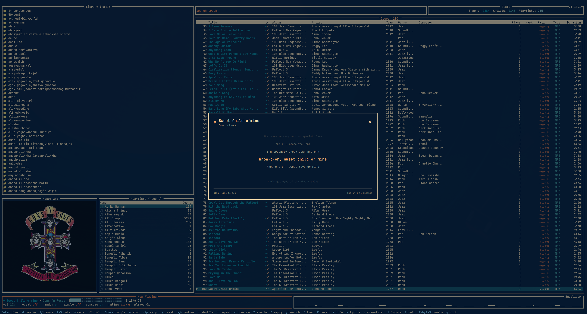
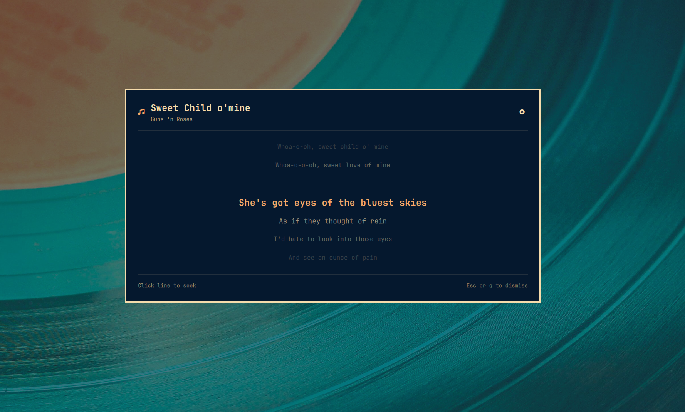

# MPD Lyrics Overlay

An Omarchy overlay plugin that presents real-time butter-smooth synced `.lrc` and plain `.txt` lyrics in a centered modal popup matching Omarchy's design language.

## Demo

<video src="assets/demo.mp4" controls width="720"></video>

## Screenshots

| In context | Modal close-up |
|---|---|
|  |  |

## Requirements

| Dependency | Needed for | Notes |
|---|---|---|
| `mpd` | Music Player Daemon | Running background music playback service. |
| `python3` | Lyrics resolver | Queries MPD via raw TCP protocol and parses local `.lrc` / `.txt` files. |

> [!IMPORTANT]
> **Lyrics file naming is strict.** The lyrics file must sit in the same directory as the track and have the exact same filename (only the extension differs), as either `.lrc` (synced) or `.txt` (plain).
>
> Example: `Sweet Child O Mine.mp3` needs `Sweet Child O Mine.lrc` (or `.txt`) next to it. No fuzzy matching, no separate lyrics directory — if the name doesn't match exactly, no lyrics are shown.

## Install

```bash
omarchy plugin add https://github.com/susamn/omarchy-plugin-mpd-lyrics.git --enable
```

<details>
<summary>Manual install</summary>

```bash
git clone https://github.com/susamn/omarchy-plugin-mpd-lyrics.git \
  ~/.config/omarchy/plugins/susamn.mpd-lyrics
omarchy-shell shell rescanPlugins
omarchy plugin enable susamn.mpd-lyrics
```
</details>

## Usage & Keybindings

Summon or dismiss the lyrics modal from the command line or IPC:

```bash
omarchy-shell susamn.mpd-lyrics toggle
omarchy-shell susamn.mpd-lyrics open
omarchy-shell susamn.mpd-lyrics close
```

### Hyprland Keybinding Example

Add this to `~/.config/hypr/bindings.lua`:

```lua
o.bind("SUPER SHIFT", "L", "MPD Synced Lyrics", "omarchy-shell susamn.mpd-lyrics toggle")
```

## Features

- **Direct Same-Directory Lyrics Discovery**:
  - Automatically resolves `<track_name>.lrc` for real-time timestamp synchronization.
  - Falls back to `<track_name>.txt` for plain text lyrics if no `.lrc` is found.
  - Displays a clean empty state if neither file exists.
- **Butter-Smooth Synced Scrolling (7-Row Window)**:
  - **Rows 0–2**: 3 preceding context lines (gradually vignetted: 0.20, 0.40, 0.65).
  - **Row 3**: Current line being sung (bold, full-opacity foreground text over an accent duration fill, prominent font size, stationary center position).
  - **Rows 4–6**: 3 upcoming context lines (gradually vignetted: 0.65, 0.40, 0.20).
  - Automatically glides lines upwards from bottom to top as song playback progresses.
- **Active Line Duration Sweep**:
  - A subtle accent-tinted fill sweeps left to right behind the active line as it plays, sized to that line's text extent rather than the full dialog width. It is a line-level timing cue for when the next line begins — not per-word karaoke timing, which plain `.lrc` does not carry.
  - The sweep is driven by a local playback clock advanced from the compositor's own frame deltas, so it stays smooth between MPD polls and never steps backwards on subprocess latency.
  - **Zero-Overhead Toggle**: Press `p` or click the stopwatch icon (`󰔛`) in the header to toggle the sweep on or off. When disabled, the active line displays with bold accent text, `FrameAnimation` halts, delegates unmount the highlight element via `Loader`, and the engine switches to a single-shot timer that sleeps entirely between lines (zero frame processing, zero VSync callbacks, zero RAM/GPU overhead).
- **Interactive Click-to-Seek**:
  - Click any line in synced lyrics mode to seek MPD playback directly to that timestamp.
- **Vim Navigation Support**:
  - `j` / `k` or `Down` / `Up`: Scroll line-by-line.
  - `Ctrl+d` / `d` & `Ctrl+u` / `u` or `PageDown` / `PageUp`: Half-page scroll.
  - `gg` / `g`: Jump to top.
  - `G`: Jump to bottom.
- **Easy Dismissal**:
  - Press `Esc`, `q`, or click anywhere outside the modal card to close.

## License

MIT — see [LICENSE](LICENSE).

